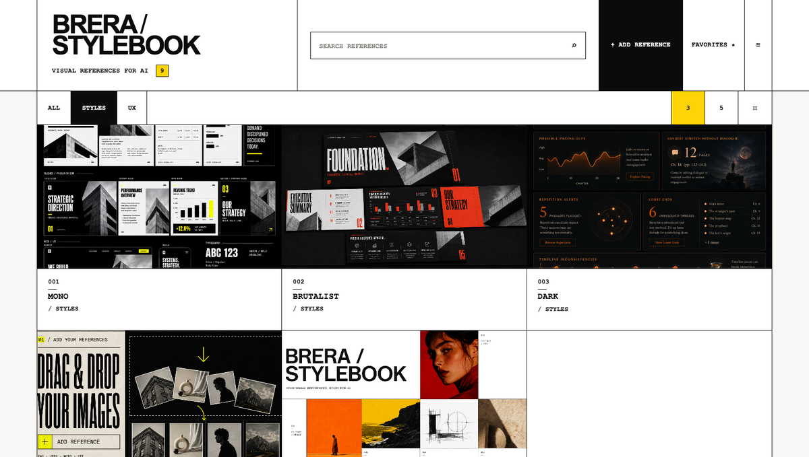
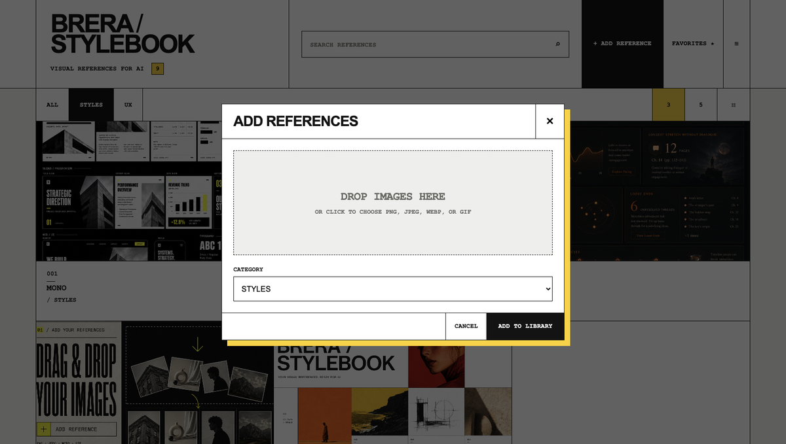
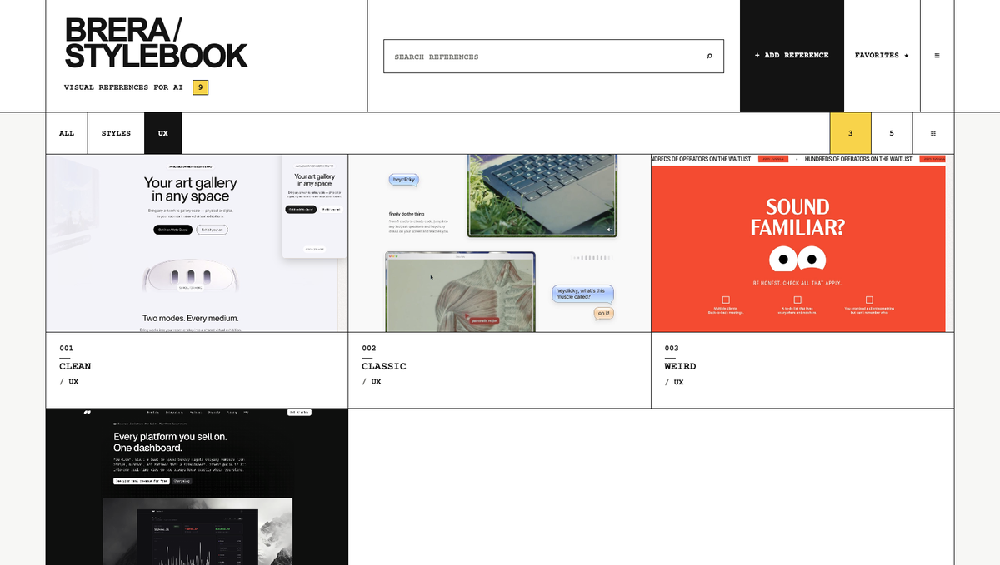
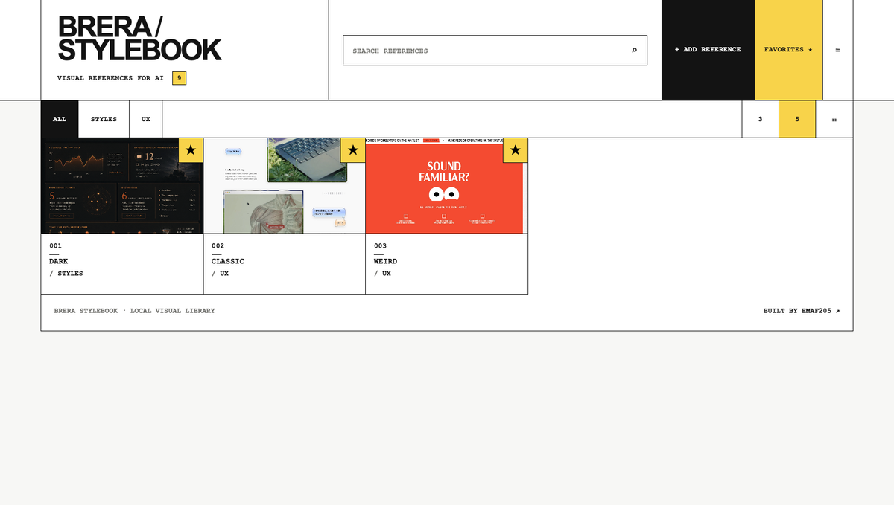
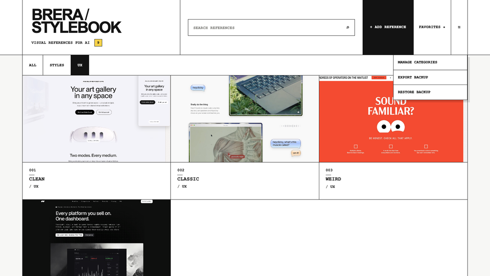

# BRERA StyleBook

<p align="center">
  
</p>

<p align="center">
  <strong>La tua libreria visuale locale per lavorare meglio con l'AI.</strong><br>
  Trova il riferimento giusto. Copialo. Riutilizzalo.
</p>

<p align="center">
  <a href="https://brera-stylebook.netlify.app/"><strong>🌐 Sito live</strong></a> ·
  <a href="https://brera-stylebook.netlify.app/guide/"><strong>📖 Guida completa</strong></a> ·
  <a href="https://emaf205.gumroad.com/l/brera-stylebook"><strong>↗ BRERA StyleBook</strong></a>
</p>

---

## Cos'è

**BRERA StyleBook 1.2.0** è una libreria visuale *local-first* pensata per organizzare e riutilizzare riferimenti visivi nei workflow con ChatGPT e altri strumenti AI.

Nasce da un problema molto semplice: avere tante reference sparse tra screenshot, Download, cartelle e bookmark, ma non riuscire a ritrovare quella giusta quando serve.

StyleBook riduce quel passaggio a:

**vedi → trovi → copi → riusi**

## Cosa puoi fare

- aggiungere immagini PNG, JPEG, WEBP e GIF;
- organizzare le reference in categorie personalizzate;
- cercare per titolo;
- filtrare i preferiti;
- passare tra vista griglia e lista;
- rinominare e ricategorizzare le reference;
- copiare un'immagine negli appunti con un click;
- esportare un backup JSON;
- ripristinare una libreria con modalità **Merge** o **Replace**.

La versione **1.2.0** include **9 reference iniziali** nelle categorie **STYLES** e **UX**.

## Dentro StyleBook

<p align="center">
  
  
  
</p>

<p align="center">
  
  
  
</p>

## Perché l'ho creato

Le cartelle archiviano bene i file. Il problema arriva dopo: quando devi **ritrovare rapidamente una reference e usarla in un prompt o in una nuova generazione**.

BRERA StyleBook è costruito intorno a quel momento.

Non vuole essere un DAM, un CMS o un archivio complesso. È un piccolo strumento visuale per avere le reference pronte quando servono.

## Repository pubblico

Questa repository contiene il **sito pubblico, la documentazione e gli asset dimostrativi** di BRERA StyleBook.

```text
/
├── index.html
├── guide/
├── contact/
├── privacy/
├── assets/
├── styles.css
├── app.js
├── process_form.php
├── netlify.toml
├── sitemap.xml
├── robots.txt
├── llms.txt
└── documentazione di supporto
```

Il pacchetto dell'applicazione distribuita agli utenti è separato dalla repository pubblica.

## Versione live

**https://brera-stylebook.netlify.app/**

Il sito include panoramica del prodotto, guida completa, pagina contatti, privacy e demo del workflow.

## Creato da EmaF205

[LinkedIn](https://it.linkedin.com/in/emanuelebdc) · [GitHub](https://github.com/emaf205)
