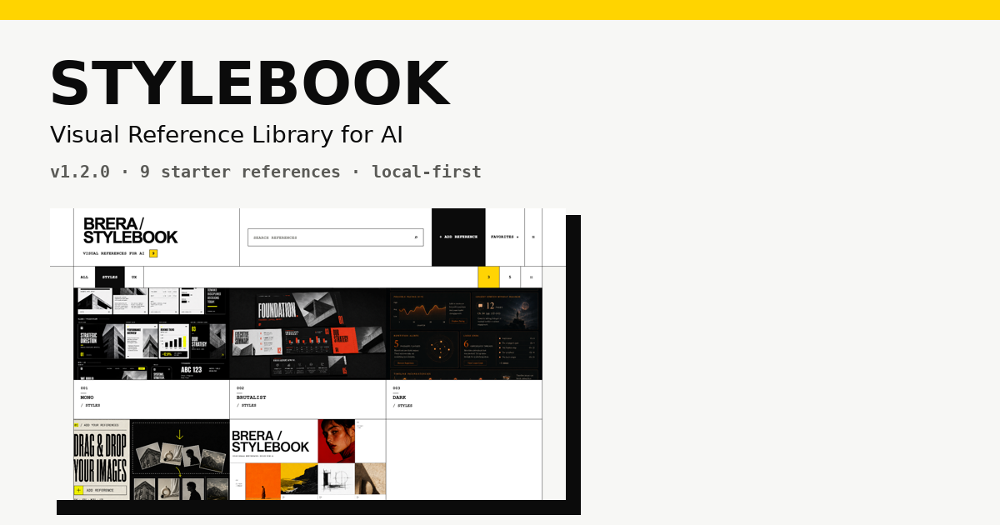
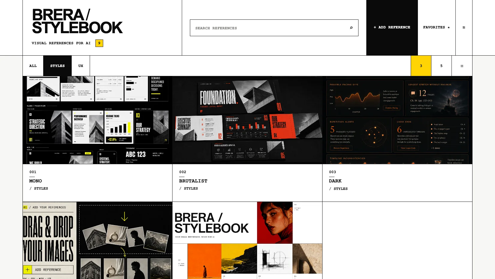
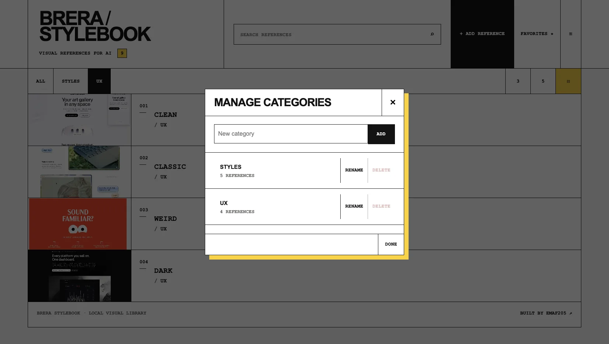
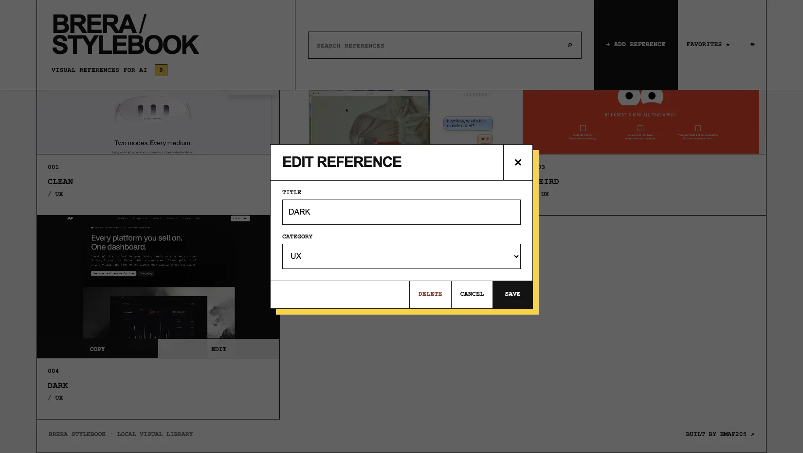

# BRERA StyleBook

<p align="center">
  
</p>

<p align="center">
  <strong>Una libreria visuale local-first per i workflow con l'AI.</strong><br>
  Trova il riferimento. Copialo. Usalo.
</p>

<p align="center">
  <a href="https://brera-stylebook.netlify.app/"><strong>Sito live</strong></a> ·
  <a href="https://brera-stylebook.netlify.app/guide/"><strong>Guida completa</strong></a> ·
  <a href="https://emaf205.gumroad.com/l/brera-stylebook"><strong>BRERA StyleBook</strong></a>
</p>

---

## Cos'è

**BRERA StyleBook 1.2.0** nasce per risolvere un problema semplice: le reference visive finiscono tra screenshot, Download, cartelle e bookmark e, quando servono davvero, bisogna ricominciare a cercarle.

StyleBook concentra il flusso in quattro passaggi:

**vedi → trovi → copi → riusi**

È una libreria visuale locale pensata per avere le reference pronte da portare in ChatGPT o in altri strumenti AI compatibili.

## Cosa puoi fare

- aggiungere immagini PNG, JPEG, WEBP e GIF;
- creare e gestire categorie personalizzate;
- cercare le reference;
- salvare i preferiti;
- usare viste a 3 colonne, 5 colonne o lista;
- rinominare e ricategorizzare le immagini;
- copiare una reference negli appunti con un click;
- esportare un backup JSON;
- ripristinare la libreria con **Merge** o **Replace**.

La versione **1.2.0** include **9 reference iniziali** divise tra **STYLES** e **UX**.

## Il prodotto

<p align="center">
  
  
</p>

<p align="center">
  
  
  
</p>

## Perché l'ho creato

Le cartelle sono ottime per conservare file. Sono meno adatte al momento in cui devi **vedere, scegliere e riutilizzare velocemente un riferimento visivo**.

BRERA StyleBook è costruito intorno a quel momento, senza diventare un DAM o un CMS complesso.

## Repository

Questa repository contiene il **sito pubblico, la guida, la documentazione e gli asset dimostrativi** di BRERA StyleBook.

```text
/
├── index.html
├── guide/
├── contact/
├── privacy/
├── assets/
├── styles.css
├── app.js
├── netlify.toml
├── sitemap.xml
├── robots.txt
├── llms.txt
└── documentazione
```

Il pacchetto dell'applicazione distribuito agli utenti è separato dalla repository pubblica.

## Live

**https://brera-stylebook.netlify.app/**

## Autore

Creato da **EmaF205**.

[LinkedIn](https://it.linkedin.com/in/emanuelebdc) · [GitHub](https://github.com/emaf205)
